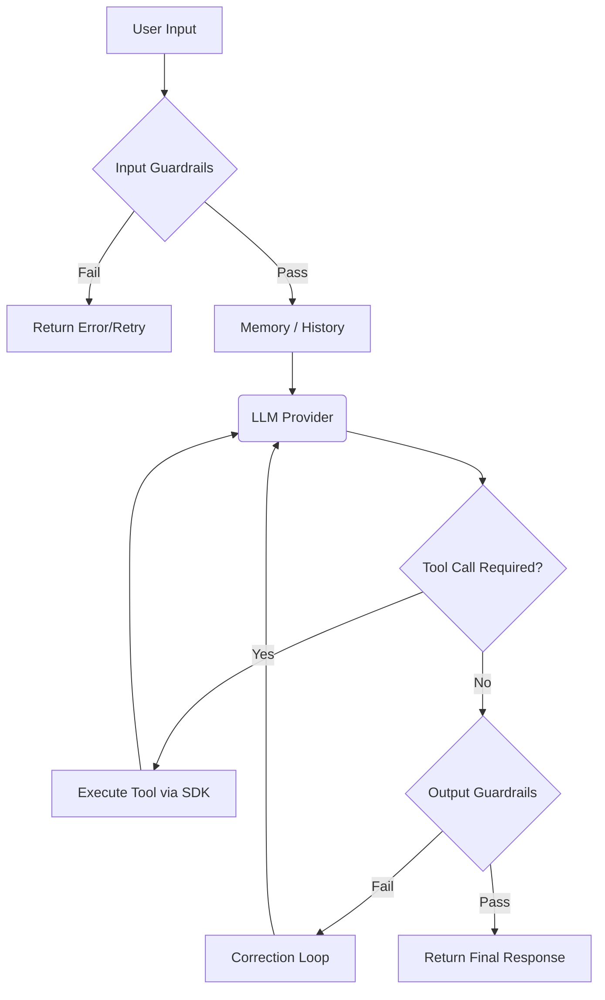

# Agents

The `Agent` class is the central orchestration engine. It manages the execution loop, memory, tools, guardrails, and provider fallback chains.

## The Agent Loop



## Basic Initialization

```typescript
import { Agent, OpenAIProvider } from "@rabbit-agent-sdk/rabbit-agent-sdk";

const agent = new Agent({
  provider: new OpenAIProvider({ apiKey: process.env.OPENAI_API_KEY }),
  systemPrompt: "You are a helpful and concise assistant.",
});

const response = await agent.run("Hello, who are you?");
console.log(response);
// → "I'm a helpful and concise assistant. How can I help you today?"
```

## Full Configuration

You can configure the agent with memory, guardrails, multiple tools, and fallbacks:

```typescript
import {
  Agent,
  OpenAIProvider,
  GroqProvider,
  BufferMemory,
  ProfanityGuardrail,
  PIIGuardrail,
  MaxLengthGuardrail,
  FetchTool,
  WebSearchTool,
} from "@rabbit-agent-sdk/rabbit-agent-sdk";

const agent = new Agent({
  // Required — the primary LLM provider
  provider: new OpenAIProvider({ apiKey: process.env.OPENAI_API_KEY }),

  // Optional — backup providers tried in order if primary fails
  fallbackProviders: [
    new GroqProvider({ apiKey: process.env.GROQ_API_KEY }),
  ],

  // Optional — system prompt injected at the start of every conversation
  systemPrompt: "You are a senior financial analyst. Be precise and cite sources.",

  // Optional — tools the agent can call
  tools: [new FetchTool(), new WebSearchTool(process.env.TAVILY_API_KEY)],

  // Optional — input/output validation guardrails
  guardrails: [
    new ProfanityGuardrail(),          // Block profanity in user input
    new PIIGuardrail(),                // Block PII in user input
    new MaxLengthGuardrail(4000, "output"),  // Cap output length
  ],

  // Optional — custom memory implementation (defaults to BufferMemory)
  memory: new BufferMemory(),

  // Optional — enable response streaming (default: false)
  stream: false,

  // Optional — max agentic loop iterations (default: 5)
  maxSteps: 10,
});
```

## AgentConfig Reference

| Property | Type | Default | Description |
| :--- | :--- | :--- | :--- |
| `provider` | `Provider` | **(required)** | Primary LLM provider |
| `fallbackProviders` | `Provider[]` | `[]` | Sequential fallback providers |
| `systemPrompt` | `string` | `undefined` | System instruction prepended to every call |
| `tools` | `Tool[]` | `[]` | Tools available to the agent |
| `guardrails` | `Guardrails[]` | `[]` | Input/output validation guardrails |
| `memory` | `Memory` | `new BufferMemory()` | Conversation memory backend |
| `stream` | `boolean` | `false` | Enable streaming responses |
| `maxSteps` | `number` | `5` | Max execution loop steps (budget control) |

<Callout type="default">
  Agents are capable of executing actions automatically. Learn how to add capabilities with [Tools](/docs/core-concepts/tools).
</Callout>
