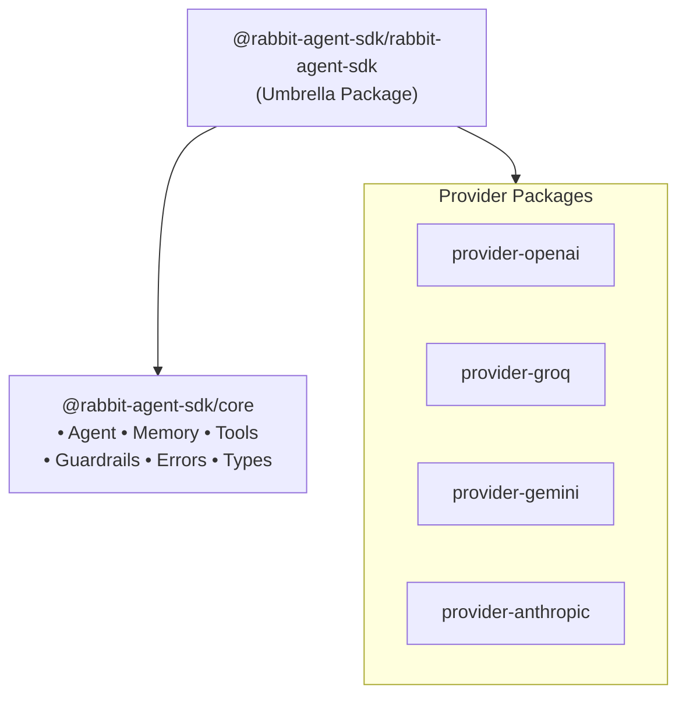

# Introduction

Rabbit SDK gives you everything you need to orchestrate Large Language Models with **strict type safety**, **automatic JSON schema conversion**, **custom tools**, **conversational memory**, **provider fallback chains**, and **safety guardrails** — all in a clean, extensible architecture. It is a provider-agnostic framework for building production-grade AI agents in TypeScript.

## Key Features

| Feature | Description |
| :--- | :--- |
| **<Icon name="Network" className="inline-block w-4 h-4 mr-1.5 mb-0.5 text-blue-500" /> Provider Agnostic** | Swap between OpenAI, Groq, Gemini (or build your own) with a single line change |
| **<Icon name="Brain" className="inline-block w-4 h-4 mr-1.5 mb-0.5 text-purple-500" /> Built-in Memory** | Automatic conversational history management with `BufferMemory` or custom backends |
| **<Icon name="Wrench" className="inline-block w-4 h-4 mr-1.5 mb-0.5 text-emerald-500" /> Zod-Powered Tools** | Define tools with `zod` schemas — automatic JSON Schema conversion and runtime validation |
| **<Icon name="ShieldCheck" className="inline-block w-4 h-4 mr-1.5 mb-0.5 text-rose-500" /> Safety Guardrails** | 8 built-in guardrails for PII detection, profanity, prompt injection, tone enforcement, and more |
| **<Icon name="Zap" className="inline-block w-4 h-4 mr-1.5 mb-0.5 text-yellow-500" /> Provider Fallbacks** | Self-healing agent loops with automatic fallback to backup providers on failure |
| **<Icon name="Radio" className="inline-block w-4 h-4 mr-1.5 mb-0.5 text-cyan-500" /> Streaming** | First-class support for streaming responses via async generators |
| **<Icon name="Globe" className="inline-block w-4 h-4 mr-1.5 mb-0.5 text-orange-500" /> Built-in Toolkit** | Pre-built `FetchTool` and `WebSearchTool` ready to use out of the box |
| **<Icon name="Gauge" className="inline-block w-4 h-4 mr-1.5 mb-0.5 text-pink-500" /> Budget Control** | `maxSteps` limiter prevents infinite agentic loops |

## Architecture



The SDK is structured as a **pnpm monorepo** with the following packages:

| Package | npm Name | Purpose |
| :--- | :--- | :--- |
| `packages/core` | `@rabbit-agent-sdk/core` | Agent engine, memory, guardrails, tools, types, errors |
| `packages/provider-openai` | `@rabbit-agent-sdk/provider-openai` | OpenAI provider (`gpt-4o` default) |
| `packages/provider-groq` | `@rabbit-agent-sdk/provider-groq` | Groq provider (`llama3-8b-8192` default) |
| `packages/provider-gemini` | `@rabbit-agent-sdk/provider-gemini` | Gemini provider (`gemini-2.5-flash` default) |
| `packages/provider-anthropic` | `@rabbit-agent-sdk/provider-anthropic` | Anthropic provider (`claude-3-5-sonnet-20241022` default) |
| `packages/rabbit-agent-sdk` | `@rabbit-agent-sdk/rabbit-agent-sdk` | Umbrella package — re-exports all of the above |

## Minimal Example

<Callout type="info">
  This is a minimal example using the OpenAI provider. You can easily swap this with Gemini, Groq, or Anthropic.
</Callout>

```typescript
import { Agent, OpenAIProvider } from "@rabbit-agent-sdk/rabbit-agent-sdk";
import { z } from "zod";

const agent = new Agent({
  provider: new OpenAIProvider({ apiKey: process.env.OPENAI_API_KEY }),
  systemPrompt: "You are a helpful assistant.",
  tools: [{
    name: "getWeather",
    description: "Get the current weather for a location",
    schema: z.object({ location: z.string() }),
    execute: async ({ location }) => `The weather in ${location} is sunny.`,
  }],
});

const response = await agent.run("What's the weather in Tokyo?");
console.log(response);
// → "The weather in Tokyo is sunny."
```

<Callout type="default">
  Ready to get started? Head over to the [Installation](/docs/getting-started/installation) page!
</Callout>
